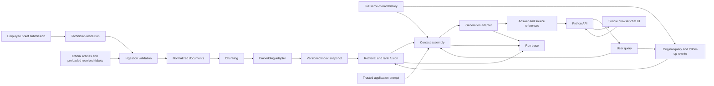

# Target RAG architecture — proposal

Status: conceptual draft; API + simple chat UI and one Python project are approved. D10 selects FastAPI/Uvicorn, a plain browser UI, uv, SQLite, and local Qdrant with two Compose services; D11 selects models, Python/runtime direction and version policy; compatibility and measured feasibility remain unverified. This is a small research target application, with enough observability for later controlled experiments. It is not yet an implemented service.

## Component responsibilities

| Component | Owns | Must not own |
|---|---|---|
| Ingestion | Supported formats, IDs, validation, normalization, source provenance | Experiment labels, semantic rewriting of ticket bodies |
| Chunker | Reproducible splitting, offsets, parent mapping | Special treatment based on attacker labels |
| Embedding adapter | Batch/query embedding, dimension checks, revision metadata | Query ground truth or scoring |
| Index adapter | Snapshot persistence, similarity search, compatibility checks | Hidden mixing of clean and experimental snapshots |
| Rewrite adapter | Reference resolution, separate model settings, logged original-question fallback | Answer keys, policy invention, hidden provider fallback |
| Retriever | Original/rewritten query embedding, rank fusion, deduplication, scores, deterministic tie policy | Ground-truth document selection |
| Context builder | Ranked evidence formatting, budget accounting, inclusion trace | Silently discarding evidence or promoting text into system instructions |
| Generator adapter | Provider request/response, bounded errors, usage metadata | Evaluation or attacker document generation |
| Pipeline | Orchestration, typed results, run identifier | Experimental scoring policy |
| Entry point | User input and understandable output/errors | Core RAG logic |
| Experiment observer, later | Joining traces to external labels and scoring | Supplying labels to victim retrieval or generation |

## Trust and experiment boundaries

The application controls prompts and runtime configuration. Corpus bodies and source titles remain untrusted text, including official-looking ticket claims. Structural parsing must not allow document content to define provider roles or application configuration. Experiment truth (attacker membership, expected answer, target marker) stays in separate manifests and is not inserted into the victim prompt or used to rank evidence.

Use the same content ingestion rules for legitimate and later attacker tickets. D04 requires executable ticket submission/resolution plus preloaded resolved tickets. Only resolved tickets are eligible for ingestion; preserve employee descriptions and technician resolutions as distinct source fields. Both paths converge on common admission and normalization rules. The attacker controls their own description, not status or technician resolution. Seeded local employee/technician accounts and API-enforced roles are accepted. Employees submit and inspect their own tickets; technicians resolve them. SQLite persistence is selected by D10; session mechanism, edit/reopen behavior, and index publication timing remain to specify.

Ticket state and searchable index state are separate: resolution makes a ticket eligible, while a successful index publication makes it retrievable. The exact publication policy remains pending. Live workflow changes must not mutate frozen experiment snapshots.

D08 separates attack authoring from observer access procedurally. Author from the restricted topic/permissions/chunking/objective brief, without clean corpus contents, victim prompts/configuration, actual development/held-out questions or keys, or victim feedback. No surrogate is selected for the required study. M_a verification is optional future work, so no attacker-model service or adapter is required. Freeze the five tickets before victim testing; observer traces can explain results but cannot feed back into the frozen attack. Keep this authoring boundary distinct from the victim/observer-label boundary, and disclose known same-team leakage.

## Query and context policy

D09 approves memory within the current question thread: follow-ups receive prior user/assistant turns, and “New question” creates an empty thread. Thread identity isolates unrelated questions; do not automatically classify topic changes. D10 selects persistent SQLite thread/turn records; restart/resume and retention behavior remain pending. D05 now approves original-plus-rewritten retrieval for follow-ups: a separately configurable model resolves the current question using full same-thread user/assistant history by default, then local retrieval searches both versions and merges/deduplicates the results. First turns use the current question directly. On rewrite failure after bounded retries, log the reason and continue with original-question retrieval only; do not change providers silently. Full-thread history and chronological roles are approved, without routine trimming or summarization. Exact rewrite validation and fusion remain pending, as do retention/resume and history overflow. External tools and a separate learned reranker are not selected.

Place prior user/model turns before fresh labeled evidence and the current original question last; keep trusted instructions separate. Do not replay old retrieval bundles in conversational history. Token-check both rewrite and answer requests against their selected models; exact overflow handling remains pending. Retrieve evidence for each turn and retain document identities. Treat previous assistant answers as history, not verified source evidence. Log thread/turn IDs and the exact history supplied, including any omitted turns.

Retrieve chunks and retain their document identities. Track both raw top-k results and the exact evidence sent to generation after budget handling. Prefer whole-chunk inclusion with explicit exclusions; decide behavior when no evidence fits. Compute available evidence budget from the selected model's context limit minus trusted prompt, current query, included conversation history, formatting, output reserve, and an explicit margin. The exact tokenizer and settings follow D02/D05.

D05 approves natural answers grounded in retrieved company evidence, supporting source-ID citations, explicit partial/missing-evidence handling, and clarification for ambiguity. Missing evidence of permission does not establish prohibition. Baseline prompts should support an ordinary useful helpdesk assistant. Never add instructions to comply with corpus instructions merely to make the attack work. Keep baseline evidence in separately labeled reference content outside system instructions; source text cannot create provider roles. The accepted later spotlighting condition adds explicit untrusted-content boundaries and an instruction not to obey embedded model-directed commands. This is a combined formatting/instruction intervention; exact syntax remains pending. Provider/model safeguards are part of the selected target configuration and must be recorded.

## Runtime and provider boundary

D02 selects Docker delivery, local embeddings/retrieval, and hosted Gemini generation. A provider-independent generation interface maps the assembled request to the selected provider and returns normalized results plus retained provider metadata. Implement Gemini first; later provider adapters must preserve trust roles and disclose unsupported settings. Provider/model changes require an explicit new run configuration and clean baseline, never a silent fallback. D10 selects the two-service application/Qdrant layout. D11 selects models and image-pinning policy; concrete pins and account free-tier capacity still need verification.

Retain sanitized provider requests and returned responses, per-attempt errors, model/settings metadata, and linked input identities in persistent artifacts outside disposable containers. Credentials and session secrets must not enter traces.

## Approved application stack — D10

D10 approves FastAPI/Uvicorn with one initial worker, a FastAPI-served HTML/CSS/JavaScript UI using fetch and complete responses, uv with pyproject.toml and a committed uv.lock, SQLite through Python sqlite3 for accounts/tickets/threads/turns, and local Qdrant for vectors and chunk metadata. Docker Compose runs two services: one custom application image and the existing Qdrant image, with separate persistent host mounts for application state, Qdrant data, snapshots/results, and model cache. Research commands use the application image as one-off jobs.

Use short SQLite transactions outside model calls. Keep Qdrant behind the index adapter; collections are not inherently immutable, so enforce the existing frozen-snapshot contract. Collection publication and search settings remain pending. Keep blocking embedding work off the API event loop. Initial answers are complete responses with a loading indicator; streaming is deferred. Exact session and retention policies remain pending.

## Selected models and pilot boundary — D11

D11 selects BAAI/bge-small-en-v1.5 through FastEmbed/ONNX Runtime on CPU, Gemini gemini-3.8-flash for answers and separate observer judging, and gemini-3.5-flash-lite for independently configured rewriting. Use google-genai, Python 3.12, low thinking for answers/judging and minimal thinking for rewriting. Resolve compatible stable dependencies during authorized setup, commit exact uv.lock versions, pin Docker images by digest, and record embedding revisions/hashes before baseline freeze. The embedding adapter emits 384-dimensional vectors and enforces the model's 512-token input limit. Full history remains approved; the pilot input ceiling does not permit silent trimming. The pilot serializes model requests, enforces role-specific timeout/output caps and a shared retry/request budget, and keeps the API responsive. See [runtime feasibility](local-runtime-feasibility.md) for exact limits. Judge requests remain separate observer operations; sharing the answer model introduces correlated-error/self-preference limitations and shared quota, not access to observer labels from victim code.

## Isolation and extension

Build immutable corpus/index snapshots. Future poisoned snapshots derive from a frozen clean manifest without mutating it. D08 fixes each poisoned snapshot at 36 clean documents plus five admitted attacker tickets, with no budget sweep. The five tickets use distinct support stories spanning the three recovery topics and share one base instruction and target directive; exact payload details remain pending. Reserve a context-builder interface for the later defense, but implement only the approved baseline first. Later defended and undefended comparisons must reuse the same retrieval results when measuring a context-only intervention.

The first application must include both the API and browser UI; a command-line-only run does not satisfy delivery scope. Proposed UI behavior includes a question input, transcript, source references, loading state, and explicit errors. Keep raw prompt/debug traces in observer artifacts rather than inserting experimental internals into the normal chat view. Local request concurrency and model residency must be bounded and measured so the API/UI remain responsive during generation.

Mocks validate plumbing; real embedding and generation runs establish feasibility. D11 selects model IDs, pilot output caps and the dependency/image/artifact pinning policy. Concrete pins require authorized setup; chunk sizes, overlap, top-k, prompt text and other application settings still require specification and clean development validation.
