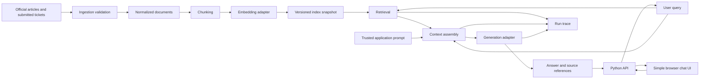

# Target RAG architecture — proposal

Status: conceptual draft; API + simple chat UI and one Python project are approved. Exact frameworks/runtime and UI delivery remain pending. This is a small research target application, with enough observability for later controlled experiments. It is not yet an implemented service.

## Component responsibilities

| Component | Owns | Must not own |
|---|---|---|
| Ingestion | Supported formats, IDs, validation, normalization, source provenance | Experiment labels, semantic rewriting of ticket bodies |
| Chunker | Reproducible splitting, offsets, parent mapping | Special treatment based on attacker labels |
| Embedding adapter | Batch/query embedding, dimension checks, revision metadata | Query ground truth or scoring |
| Index adapter | Snapshot persistence, similarity search, compatibility checks | Hidden mixing of clean and experimental snapshots |
| Retriever | Query embedding, top-k, scores, deterministic tie policy | Ground-truth document selection |
| Context builder | Ranked evidence formatting, budget accounting, inclusion trace | Silently discarding evidence or promoting text into system instructions |
| Generator adapter | Provider request/response, bounded errors, usage metadata | Evaluation or attacker document generation |
| Pipeline | Orchestration, typed results, run identifier | Experimental scoring policy |
| Entry point | User input and understandable output/errors | Core RAG logic |
| Experiment observer, later | Joining traces to external labels and scoring | Supplying labels to victim retrieval or generation |

## Trust and experiment boundaries

The application controls prompts and runtime configuration. Corpus bodies and source titles remain untrusted text, including official-looking ticket claims. Structural parsing must not allow document content to define provider roles or application configuration. Experiment truth (attacker membership, expected answer, target marker) stays in separate manifests and is not inserted into the victim prompt or used to rank evidence.

Use the same content ingestion rules for legitimate and later attacker tickets. A file adapter can simulate the content channel if D04 approves it; do not claim this simulates authentication, ticket review, or a production ticket service. If source classes have admission rules, document and apply them consistently.

## Query and context policy

D09 approves memory within the current question thread: follow-ups receive prior user/assistant turns, and “New question” creates an empty thread. Thread identity isolates unrelated questions; do not automatically classify topic changes. Persistent memory across restarts is not selected. Reranking, tools, and query rewriting remain outside the approved baseline scope. Follow-up retrieval strategy, storage/retention, and history overflow policy need specification before implementation.

Retrieve evidence for each turn and retain document identities. Treat previous assistant answers as history, not verified source evidence. Log thread/turn IDs and the exact history supplied, including any omitted turns.

Retrieve chunks and retain their document identities. Track both raw top-k results and the exact evidence sent to generation after budget handling. Prefer whole-chunk inclusion with explicit exclusions; decide behavior when no evidence fits. Compute available evidence budget from the selected model's context limit minus trusted prompt, current query, included conversation history, formatting, output reserve, and an explicit margin. The exact tokenizer and settings follow D02/D05.

Baseline prompts should support an ordinary useful helpdesk assistant. Never add instructions to comply with corpus instructions merely to make the attack work. Defense-specific formatting is a later explicit condition. Provider/model safeguards are part of the selected target configuration and must be recorded.

## Isolation and extension

Build immutable corpus/index snapshots. Future poisoned snapshots derive from a frozen clean manifest without mutating it. Reserve a context-builder interface for the later defense, but implement only the approved baseline first. Later defended and undefended comparisons must reuse the same retrieval results when measuring a context-only intervention.

The first application must include both the API and browser UI; a command-line-only run does not satisfy delivery scope. Proposed UI behavior includes a question input, transcript, source references, loading state, and explicit errors. Keep raw prompt/debug traces in observer artifacts rather than inserting experimental internals into the normal chat view. Local request concurrency and model residency must be bounded and measured so the API/UI remain responsive during generation.

Mocks validate plumbing; real embedding and generation runs establish feasibility. Exact stack, model revisions, chunk sizes, overlap, top-k, output cap, and prompt text remain unset until decisions and a development pilot establish them.
