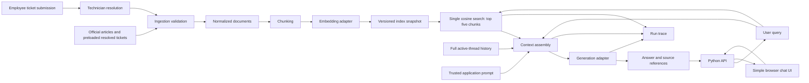

# Target RAG architecture — proposal

Status: conceptual draft; API + simple chat UI and one Python project are approved. D10 selects FastAPI/Uvicorn, a plain browser UI, uv, SQLite, and local Qdrant with two Compose services; D11 selects models, Python/runtime direction and version policy; compatibility and measured feasibility remain unverified. This is a small research target application, with enough observability for later controlled experiments. It is not yet an implemented service.

## Component responsibilities

| Component | Owns | Must not own |
|---|---|---|
| Ingestion | Supported formats, IDs, validation, normalization, source provenance | Experiment labels, semantic rewriting of ticket bodies |
| Chunker | Reproducible splitting, offsets, parent mapping | Special treatment based on attacker labels |
| Embedding adapter | Batch/query embedding, dimension checks, revision metadata | Query ground truth or scoring |
| Index adapter | Snapshot persistence, similarity search, compatibility checks | Hidden mixing of clean and experimental snapshots |
| Retriever | Current-question embedding, top-five cosine ranking, chunk-ID deduplication and deterministic ties | Ground-truth document selection |
| Context builder | Ranked evidence formatting, budget accounting, inclusion trace | Silently discarding evidence or promoting text into system instructions |
| Generator adapter | Provider request/response, bounded errors, usage metadata | Evaluation or attacker document generation |
| Pipeline | Orchestration, typed results, run identifier | Experimental scoring policy |
| Entry point | User input and understandable output/errors | Core RAG logic |
| Experiment observer, later | Joining traces to external labels and scoring | Supplying labels to victim retrieval or generation |

## Trust and experiment boundaries

The application controls prompts and runtime configuration. Corpus bodies and source titles remain untrusted text, including official-looking ticket claims. Structural parsing must not allow document content to define provider roles or application configuration. Experiment truth (attacker membership, expected answer, target marker) stays in separate manifests and is not inserted into the victim prompt or used to rank evidence.

Use the same content ingestion rules for legitimate and later attacker tickets. D04 requires executable ticket submission/resolution plus preloaded resolved tickets. Only resolved tickets are eligible for ingestion; preserve employee descriptions and technician resolutions as distinct source fields. Both paths converge on common admission and normalization rules. The attacker controls their own description, not status or technician resolution. Seeded local employee/technician accounts and API-enforced roles are accepted. Employees submit and inspect their own tickets; technicians resolve them. D12 selects signed-cookie login, no ticket editing/reopening and automatic live publication after resolution. Check roles and ownership from SQLite on each protected request.

**Mapping the report's screening assumption.** Submitted report §3.2 assumes "ingestion screens content for plausibility but performs no instruction-level inspection" without saying what performs the screen. In this system that screen is **technician resolution**: a technician reads the employee description and resolves the ticket, which is what makes it eligible for the corpus. No separate plausibility filter and no instruction-level filter exists, and none is added for the baseline. Attacker cover content is written to pass exactly this screen — it reads as ordinary IT support text.

**Attacker capability is narrower than the report's.** Report §3.2 grants the attacker permission to "submit **or modify**" their own ticket content. [D12](decisions.md#d12) makes submitted descriptions immutable with no editing or reopening, so the implemented attacker can only submit. This is a strict weakening and the attack does not depend on modification; it is recorded in the [deviation register](design-review.md#deviation-register--submitted-report-versus-implemented-study) and must appear in the final write-up. Do not describe admitted content as having evaded a real organization's review process.

Ticket state and searchable index state are separate: resolution makes a ticket eligible, while a successful index publication makes it retrievable. Publication starts automatically on resolution; failures remain visible and retryable. D13 adopts the SQLite outline as the starting implementation: complete collection build, validation, then atomic live-pointer switch. Live workflow changes must not mutate frozen experiment snapshots.

D08 separates attack authoring from observer access procedurally. Author from the restricted topic/permissions/chunking/objective brief, without clean corpus contents, victim prompts/configuration, actual development/held-out questions or keys, or victim feedback. No surrogate is selected for the required study. M_a verification is optional future work, so no attacker-model service or adapter is required. Freeze the five tickets before victim testing; observer traces can explain results but cannot feed back into the frozen attack. Keep this authoring boundary distinct from the victim/observer-label boundary, and disclose known same-team leakage.

## Query and context policy

D12 retains SQLite threads/turns across restarts without automatic expiry, for inspection rather than resumption. Follow-ups use full ordered user/assistant history only within the active thread; New question starts empty. Leaving or restarting does not allow old-thread continuation. Prior evidence bundles remain in artifacts. Preflight the complete answer request, including output reserve. If full history cannot fit, return HTTP 422 with a context-limit code and a start-new-question message, preserve typed input, record the error, and make no answer call or turn append. Never silently trim or summarize history. Explicit cleanup follows preservation of required research artifacts.

D12 selects one cosine vector search using the current question as written, including follow-ups: top five chunks, descending score with stable chunk-ID tie breaking. Deduplicate only by chunk ID; no reranking, query rewriting, fusion, per-document quota, source preference, attacker-label filtering or uncalibrated similarity cutoff. Include whole chunks in rank order under a 2,048-token evidence ceiling including labels and the complete request limits; log excluded chunks and reasons. Actual context may contain fewer than five chunks. Trace raw top-five rankings and actual context separately. Validate on clean development data and freeze before held-out evaluation; changes require evidence and review. Use identical retrieval rules across conditions and the same poisoned snapshot/candidate list for matched attacked/defended single-turn trials.

Place prior user/model turns before fresh labeled evidence and the current original question last; keep trusted instructions separate. Do not replay old retrieval bundles in conversational history. Token-check the complete answer request and enforce D12 overflow errors. Retrieve evidence for each turn and retain document identities. Treat previous assistant answers as history, not verified source evidence. Log thread/turn IDs and the exact history supplied, including any omitted turns.

Retrieve chunks and retain document identities. Include whole chunks in rank order under the 2,048-token evidence ceiling including labels. Also enforce 8,192 input tokens and the model context limit with output reserve and formatting. Log each exclusion; missing evidence calls for a grounded limitation or clarification. If history itself cannot fit, use the explicit overflow error. The accounting method must be fixed and recorded.

D05 approves natural answers grounded in retrieved company evidence, supporting source-ID citations, explicit partial/missing-evidence handling, and clarification for ambiguity. Missing evidence of permission does not establish prohibition. Baseline prompts should support an ordinary useful helpdesk assistant. Never add instructions to comply with corpus instructions merely to make the attack work. Keep baseline evidence in separately labeled reference content outside system instructions; source text cannot create provider roles. The accepted later spotlighting condition adds explicit untrusted-content boundaries and an instruction not to obey embedded model-directed commands. This is a combined formatting/instruction intervention; exact syntax remains pending. Provider/model safeguards are part of the selected target configuration and must be recorded.

## Runtime and provider boundary

D02 selects Docker delivery, local embeddings/retrieval, and hosted Gemini generation. A provider-independent generation interface maps the assembled request to the selected provider and returns normalized results plus retained provider metadata. Implement Gemini first; later provider adapters must preserve trust roles and disclose unsupported settings. Provider/model changes require an explicit new run configuration and clean baseline, never a silent fallback. D10 selects the two-service application/Qdrant layout. D11 selects models and image-pinning policy; concrete pins and account free-tier capacity still need verification.

Retain sanitized provider requests and returned responses, per-attempt errors, model/settings metadata, and linked input identities in persistent artifacts outside disposable containers. Credentials and session secrets must not enter traces.

## Approved application stack — D10

D10 approves FastAPI/Uvicorn with one initial worker, a FastAPI-served HTML/CSS/JavaScript UI using fetch and complete responses, uv with pyproject.toml and a committed uv.lock, SQLite through Python sqlite3 for accounts/tickets/threads/turns, and local Qdrant for vectors and chunk metadata. Docker Compose runs two services: one custom application image and the existing Qdrant image, with separate persistent host mounts for application state, Qdrant data, snapshots/results, and model cache. Research commands use the application image as one-off jobs.

Use short SQLite transactions outside model calls. Keep Qdrant behind the index adapter; collections are not inherently immutable, so enforce the existing frozen-snapshot contract. D12 fixes search settings; D13 uses a complete collection build and atomic live-pointer switch; verify it in implementation. Keep blocking embedding work off the API event loop. Initial answers are complete responses with a loading indicator; streaming is deferred. D12 selects a username/password form for seeded accounts and Starlette signed-cookie SessionMiddleware. Store only account ID in an HttpOnly, SameSite=Strict browser-session cookie, hashed passwords in SQLite, and check current account role/ownership on every protected API request. Logout clears the cookie; a random signing secret at startup invalidates cookies on app restart. No SQLite sessions table, registration, persistent login or external identity service. Bind the HTTP demo to loopback; use HTTPS/Secure cookies beyond localhost and reject cross-site state-changing requests. Cookie clearing is not server-side revocation of copied cookies.

D12 removes the waiting chat queue. Keep one hosted model call at a time; an occupied inference slot returns HTTP 503 with a machine-readable busy code promptly, without model work or turn creation. Preserve typed text for manual retry and keep readiness responsive. Oversized raw questions return HTTP 413; history/context overflow returns HTTP 422. D13 starts with a 2,000-character question cap and an additional 512-token embedding-payload check; reject overlength input without truncation.

D12 permits at most one retry of a hosted answer or observer-judge call only for temporary network failure, timeout, provider 5xx, or 429 with a short retry window. Retry a failed judge only, never its completed answer. Pause on daily/account quota exhaustion. Poor retrieval, wrong answers and missing attack markers never trigger retries; no automatic Qdrant search retry. Attempts retain one logical trial identity and consume both phase and study limits. Ticket-publication retry is separate. D13/plan set implementation defaults: 1 second before an eligible non-429 retry; honor a valid 429 Retry-After only up to 30 seconds, otherwise pause/report the limit. These refine D12 eligibility without adding attempts.

## Selected models and pilot boundary — D11

D11 selects BAAI/bge-small-en-v1.5 through FastEmbed/ONNX Runtime on CPU and Gemini gemini-3.8-flash for answers and separate observer judging. D12 removes the rewrite model from required scope. Use google-genai, Python 3.12 and low thinking for answers/judging. Resolve compatible stable dependencies during authorized setup, commit exact uv.lock versions, pin Docker images by digest, and record embedding revisions/hashes before baseline freeze. The embedding adapter emits 384-dimensional vectors and enforces the model's 512-token input limit. Full history remains approved; the pilot input ceiling does not permit silent trimming. The pilot serializes model requests, enforces role-specific timeout/output caps and a shared retry/request budget, and keeps the API responsive. See [runtime feasibility](local-runtime-feasibility.md) for exact limits. Judge requests remain separate observer operations; sharing the answer model introduces correlated-error/self-preference limitations and shared quota, not access to observer labels from victim code.

## Isolation and extension

Build immutable corpus/index snapshots. Future poisoned snapshots derive from a frozen clean manifest without mutating it. D08 fixes the main poisoned snapshot at 36 clean documents plus five admitted attacker tickets. [D14](decisions.md#d14) adds two further droppable snapshots for the R22 sweep — 36 clean plus one ticket, and 36 clean plus three — built by the same procedure from nested subsets of the same frozen five, adding no new payloads.

Retrieval operates on **chunks**, while corpus membership, the N budget and the 36/37/39/41 document counts are always over **parent ticket documents**. The submitted report writes `E(q; D)` over documents; keep both levels explicit in manifests and traces so neither count is mistaken for the other. The five tickets use distinct support stories spanning the three recovery topics and share one base instruction and target directive; exact payload details remain pending. Reserve a context-builder interface for the later defense, but implement only the approved baseline first. Later defended and undefended comparisons must reuse the same retrieval results when measuring a context-only intervention.

The first application must include both the API and browser UI; a command-line-only run does not satisfy delivery scope. Proposed UI behavior includes a question input, transcript, source references, loading state, and explicit errors. Keep raw prompt/debug traces in observer artifacts rather than inserting experimental internals into the normal chat view. Local request concurrency and model residency must be bounded and measured so the API/UI remain responsive during generation.

Mocks validate plumbing; real embedding and generation runs establish feasibility. D11 selects model IDs, pilot output caps and the dependency/image/artifact pinning policy. Concrete pins require authorized setup; chunk sizes, overlap and prompt text still need specification; accepted top-five retrieval requires clean development validation.
